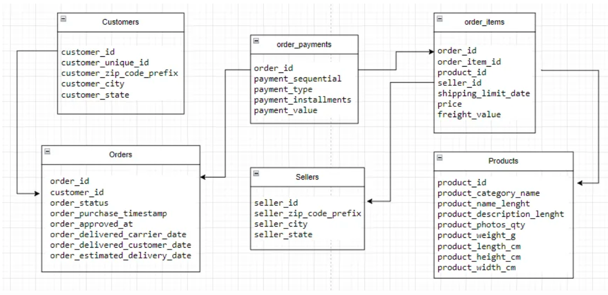
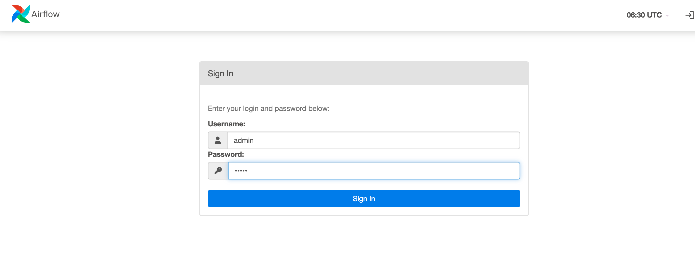
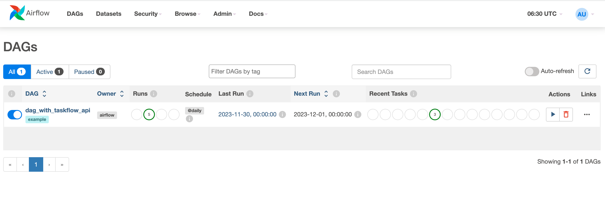

# **Introduction** 

In this project we will build data-lake from scratch.

 

**Tech** : Spark, Hadoop, Athena, EMR, S3, Python, ELK, Kafka, Airflow and Glue.

## **How to run Postgresql in your local machine**

- Go to folder .../datalake/docker/database

- Execute _docker compose up_

- To Access the pgadmin4 via your favorite web browser by visiting the URL http://localhost:5050/. 
- Use the **admin@admin.com** as the email address and **root** as the password to log in.
- Click **Register** > **Server** to create a new server.
- Fill General and Connection details as below

 

### Start Using :

- Create Database with query "CREATE DATABASE e_commerce"

## **Database Schema**

## **Alter Table Schema to add ingestion_timestamp column**

`ALTER TABLE customers ADD COLUMN ingestion_timestamp TIMESTAMPTZ NOT NULL DEFAULT NOW();`

## Data model that supports the following analysis:

- What places contributed the most/least to product sales?
- Which seller sold the most/least products?
- Best and worst performing products.
- Date for everything.

## Steps to start Airflow 

- Start the Docker Desktop
- Go to project root location 
- Build Docker Image  -> ./mwaa-local-env build-image
- Run Apache Airflow -> ./mwaa-local-env start 
- Access the UI 
  Open the Airflow UI: http://localhost:8080/
  Username: admin 
  Password: test
  

  

