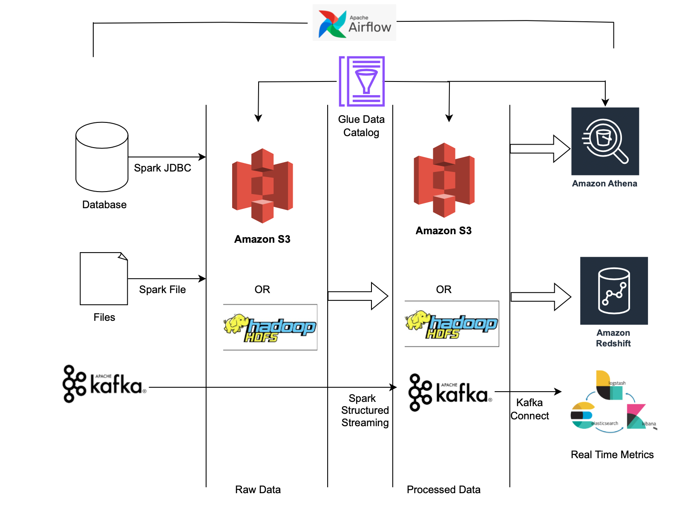
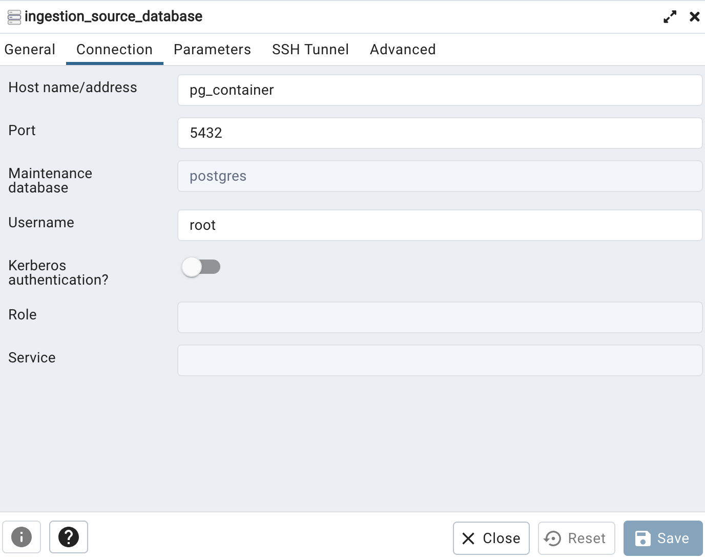
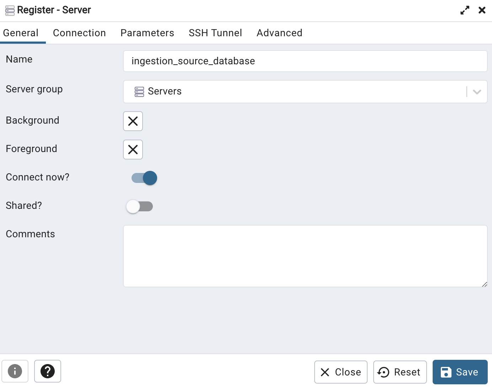
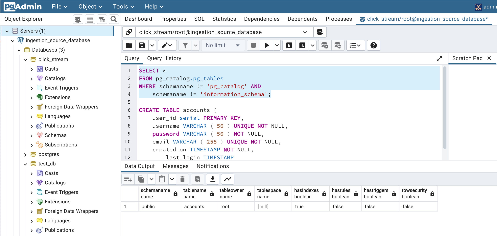

# **Introduction** 

In this project we will build data-lake from scratch.

 

**Tech** : Spark, Hadoop, Athena, EMR, S3, Python, ELK, Kafka, Airflow and Glue.

## **How to run Postgresql in your local machine**

- Go to folder .../datalake/docker/database

- Execute _docker compose up_

- To Access the pgadmin4 via your favorite web browser by visiting the URL http://localhost:5050/. 
- Use the **admin@admin.com** as the email address and **root** as the password to log in.
- Click **Register** > **Server** to create a new server.
- Fill General and Connection details as below

 

### Start Using :

 

